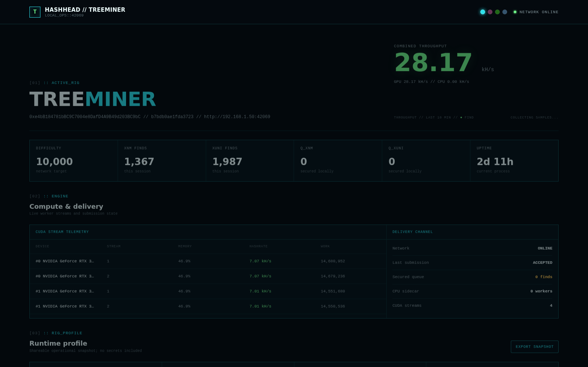

# TreeMiner

**A GPU miner for [XenBlocks](https://xenblocks.io) (X1 Network).**
Forked from [woodysoil/XenblocksMiner](https://github.com/woodysoil/XenblocksMiner) (MIT).

Current source release: **v1.4.1**. See the [changelog](CHANGELOG.md) and
[CUDA tuning guide](treeminer/docs/CUDA_TUNING.md) for measured tuning results
and a reproducible benchmark workflow.



XenBlocks is a proof-of-work protocol on the X1 Network. Miners compute Argon2id
hashes whose memory cost `m` is set by the network difficulty; a hash containing the
`XEN11` pattern is an XNM block (`XEN1111` a super block), and a hash containing `XUNI`
is a XUNI block, valid only in the :55–:05 window around each hour. Finds are submitted
to the network verifier over HTTP and credited to the miner's EVM address.

## Architecture

- **Find journal** — every GPU find is written to a local SQLite journal (WAL,
  `synchronous=FULL`) before submission, as an immutable PHC-format record of the exact
  parameters the batch hashed with.
- **Submission pipeline** — a dedicated thread drains the journal to the verifier
  through a circuit breaker and an adaptive drain scheduler that paces `/verify`
  traffic and backs off per response class.
- **Confirmation** — a 200 on `/verify` marks a find `AcceptedUnconfirmed`; it is only
  counted as `Acked` after `GET /get_block` returns the stored record.
- **Find lifecycle** — nine explicit journal states cover pending, parked difficulty,
  XUNI submission windows, quarantine, confirmation, and terminal outcomes, with
  automatic re-eligibility when conditions change.
- **Operations console** — the built-in HashHead web console (screenshot above) serves
  per-stream CUDA telemetry, delivery-channel state, and an exportable runtime profile
  on `http://<rig>:42069`.
- **Compute path** — per-stream VRAM budgeting, difficulty-change-safe batch rebuilds,
  and CUDA 13 support across multi-GPU rigs.

## How it works

```
GPU find -> immutable PHC capture -> SQLite WAL journal (fsync'd)  ->  SubmissionManager
                                          |                              |  circuit breaker
                                     crash-safe storage             adaptive drain, backoff,
                                                                    /get_block confirmation
```

Validated end-to-end: 32 CTest suites, a chaos harness against a protocol-faithful mock
server with fault injection, and live production mining with server-confirmed XEN11 and
XUNI blocks.

## Layout

| Path | Contents |
|---|---|
| `treeminer/` | The miner (fork of XenblocksMiner + TreeMiner components). See `treeminer/PLAN.md` (design authority) and `treeminer/CHANGES-FROM-UPSTREAM.md` (divergence log) |
| `treeminer/rust/` | Incremental Rust host crates (protocol, journal, submit, hash FFI, orchestrator). CUDA stays C++. See `treeminer/rust/README.md` |
| `treeminer/src/journal/` | Durable SQLite find journal |
| `treeminer/src/submit/` | Response classifier, circuit breaker, drain scheduler, submission manager |
| `treeminer/web/` | HashHead operations console (React) |
| `treeminer/tests/` | Unit suites + mock server with fault injection |
| `docs/` | Research and design documentation |

## Building (Linux / WSL2)

Requires CMake ≥ 3.18, Ninja, [vcpkg](https://github.com/microsoft/vcpkg) (dependencies are
declared in `treeminer/vcpkg.json`; a repo-local overlay port enables the secp256k1 recovery
module), and a GPU toolchain: **CUDA toolkit 12.x for NVIDIA** (default) or **ROCm with HIP
for AMD** (CMake ≥ 3.21).

```sh
cmake -S treeminer -B build -G Ninja \
  -DCMAKE_TOOLCHAIN_FILE=$HOME/vcpkg/scripts/buildsystems/vcpkg.cmake
cmake --build build -j
ctest --test-dir build
./build/bin/xenblocksMiner --execute --minerAddr 0xYourAddress --totalDevFee 0
```

For AMD cards, add `-DTREEMINER_GPU_BACKEND=HIP` to the configure line. Both vendors share
one kernel source; see `treeminer/doc/BUILD_INSTRUCTIONS.md` for the gfx targets, the
ROCm SMI telemetry dependency, and what differs from the NVIDIA build. `nix develop` (see
`flake.nix`) gives a ready ROCm toolchain and all dependencies without vcpkg.

The AMD path is validated on an RX 7900 XTX (gfx1100, ROCm 7.2): digests match the CPU
Argon2 reference, all 27 CTest suites pass, and the miner sustains ~5.2 kH/s at
difficulty 42069.

The console is served on port `42069` by default (`--dashboard-port` to change,
`--dashboard-bind 127.0.0.1` to keep it private to the machine).

## License

MIT (`LICENSE`, mirrored at `treeminer/LICENSE`), preserving woodysoil/XenblocksMiner
attribution. The reference server repo (jacklevin74/xenminer) is unlicensed: it was read
for protocol semantics only and **no code from it is included**.
